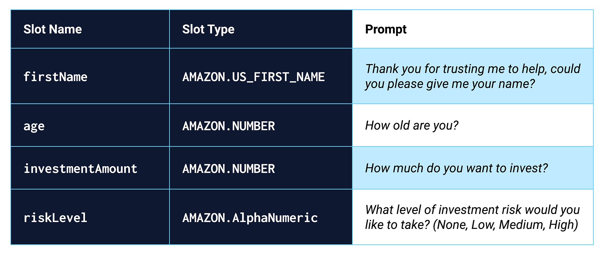

# Robo_Advisor
A robo advisor using AWS, Amazon Lex, and Amazon Lambda to help a consumer pick investment portfolio

---

## Technologies

This application is written in Python v. 3.9.7 and uses [AWS](https://aws.amazon.com/console/) to deploy the code. This application makes use of
 the following libraries:

[datautil](https://dateutil.readthedocs.io/en/stable/) was used to edit datetime objects

[datetime](https://docs.python.org/3/library/datetime.html) was used to work with dates in the datetime format

---

## Installation Guide

Prior to running this application, perform the following in the command line to install the required libraries:

`pip install datautil`

`pip install datetime`

The user will also need an account with AWS recreate and run this system.

---

## Usage

In order to launch the application, open AWS and navigate to Amazon Lex. In Amazon Lex, create a new bot named RoboAdvisor and the following intents need to be added:

-I want to save money for my retirement

-I'm {age} and I would like to invest for my retirement

-I'm ​{age} and I want to invest for my retirement

-I want the best option to invest for my retirement

-I'm worried about my retirement

-I want to invest for my retirement

-I would like to invest for my retirement

Next the following slots need to be added:

Then open Amazon Lambda and create a new lambda function. Add into the code section the code from lambda_function.py. Back in Amazon Lex, the lambda function needs to be linked and the bot can then be built and run. Below are examples of the bot running before and after integration with the lambda function:

---

## Contributors

Robby Odum

Email: rodum012@gmail.com

---

## License

MIT